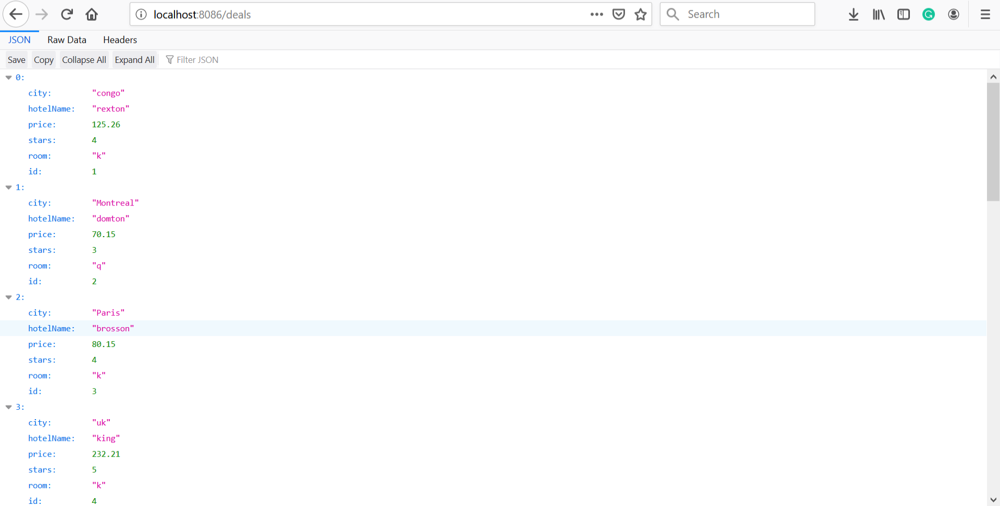
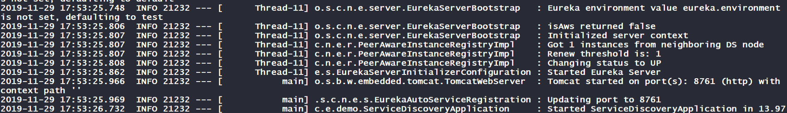
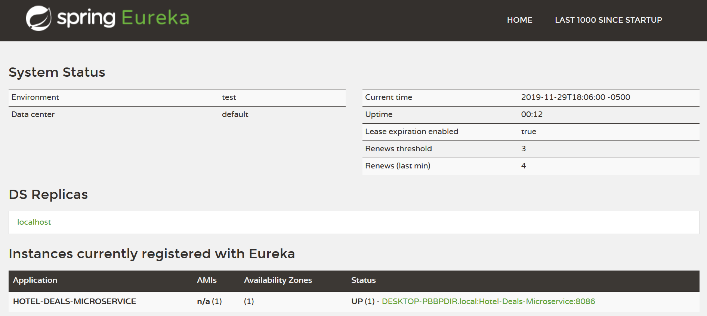
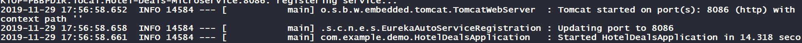

# Hotel 

small  hotel  application designed  with the microservice  architecture pattern

## Topics
<ul>
  <li>Java 8 </li>
  <li>Spring boot</li>
  <li>Spring cloud</li>
  <li>Eureka</li>
  <li>Git bash</li>
</ul>

## Preview

<br>


## Instructions

<p>After cloning the repository run the following commands inside the run folder. Important note, I'm using the git bash 
  terminal.
</p>

<ul>
  <li>Start the eureka server first.<br><br>
  
```
java  -jar server.jar &
```
  </li>
    <li> Wait until you see the following message. <br> 
      
      
  </li>
  <li>Start the hotel deals microservice next.

```
java -jar hotel-deals.js &
```
</li>After starting both microservices go to  <strong>http://localhost:8761/</strong><br>
     
</ul>  

## To stop the services from running do the following

```
ps aux 
```



```
kill 1234 
```


